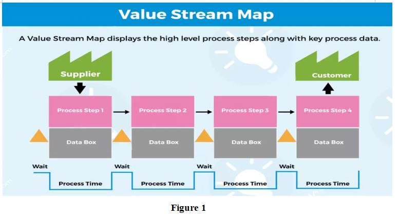
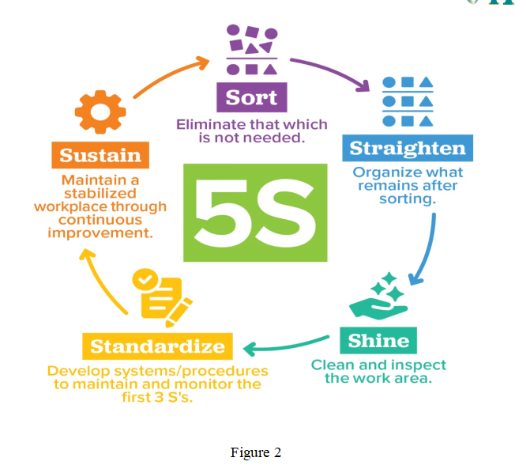
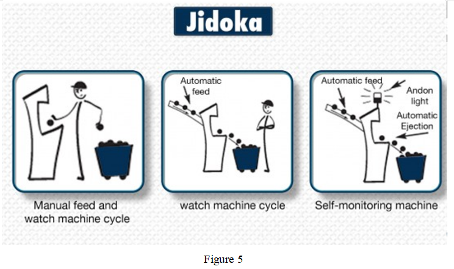
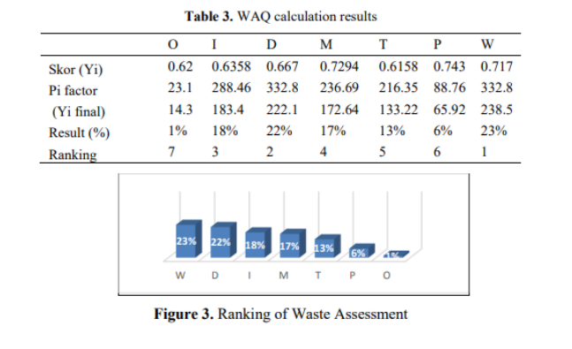
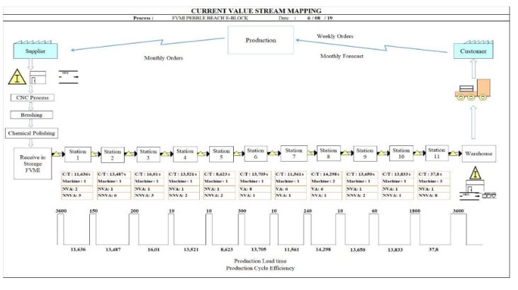
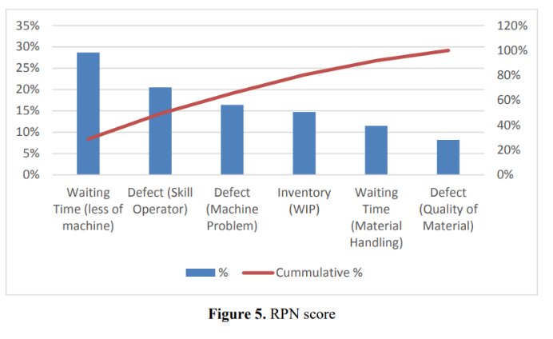
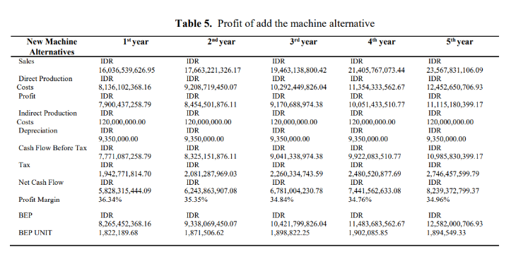
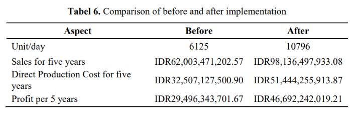
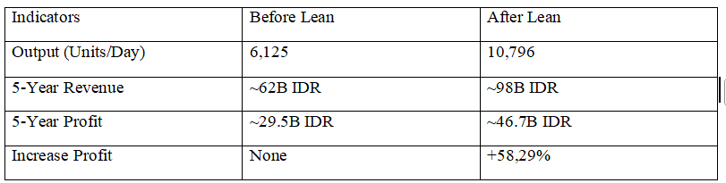

```{r setup, include=FALSE}
knitr::opts_chunk$set(
  echo = FALSE, message = FALSE, warning = FALSE
)

suppressPackageStartupMessages({
  library(tidyverse)
  library(lubridate)
  library(scales)
})

ensure_pkg <- function(p){
  if (!requireNamespace(p, quietly = TRUE)) install.packages(p, repos = "https://cloud.r-project.org")
}
ensure_pkg("highcharter")
ensure_pkg("lpSolve")
ensure_pkg("DiagrammeR")

library(highcharter)
library(lpSolve)
library(DiagrammeR)

options(highcharter.theme = hc_theme_flat())
hc_lang <- list(thousandsSep = ",", decimalPoint = ".")

# Highcharter version compatibility: some versions do not have hc_lang()
hc_lang_safe <- function(h, lang_list){
  # If hc_lang exists, use it; otherwise try hc_opts(lang=); else no-op.
  if (exists("hc_lang", where=asNamespace("highcharter"), inherits=FALSE)) {
    return(highcharter::hc_lang(h, lang_list))
  }
  if (exists("hc_opts", where=asNamespace("highcharter"), inherits=FALSE)) {
    return(highcharter::hc_opts(h, lang = lang_list))
  }
  h
}


# ---- run-from-anywhere path helper ----
get_script_dir <- function(){
  cmdArgs <- commandArgs(trailingOnly = FALSE)
  fileArgName <- "--file="
  m <- grep(fileArgName, cmdArgs)
  if (length(m) > 0) return(dirname(normalizePath(sub(fileArgName, "", cmdArgs[m]), winslash="/")))
  if (!is.null(sys.frames()[[1]]$ofile)) return(dirname(normalizePath(sys.frames()[[1]]$ofile, winslash="/")))
  if (requireNamespace("rstudioapi", quietly = TRUE) && rstudioapi::isAvailable()) {
    p <- rstudioapi::getActiveDocumentContext()$path
    if (nzchar(p)) return(dirname(normalizePath(p, winslash="/")))
  }
  normalizePath(getwd(), winslash="/")
}
PROJECT_ROOT <- get_script_dir()
base_dir <- file.path(PROJECT_ROOT, "companyA_synthetic")
dir.create(file.path(base_dir, "analysis_outputs_r"), showWarnings = FALSE, recursive = TRUE)
dir.create(file.path(base_dir, "optimization_outputs_r"), showWarnings = FALSE, recursive = TRUE)

COL_BEFORE <- "#2C3E50"
COL_AFTER  <- "#18BC9C"
COL_WARN   <- "#F39C12"
COL_BAD    <- "#E74C3C"

# Helper: highcharter time series
hc_timeseries <- function(df, x, y, group=NULL, title="", ytitle="", subtitle=""){
  df <- df %>% arrange({{x}})
  h <- highchart() %>%
    hc_chart(zoomType="x") %>%
    hc_title(text = title) %>%
    hc_subtitle(text = subtitle) %>%
    hc_xAxis(type="datetime") %>%
    hc_yAxis(title = list(text=ytitle)) %>%
    hc_tooltip(shared=TRUE, crosshairs=TRUE) %>% hc_lang_safe(hc_lang)
  if (is.null(group)){
    h <- h %>% hc_add_series(df, "line", hcaes(x={{x}}, y={{y}}))
  } else {
    h <- h %>% hc_add_series_list(
      df %>%
        group_by({{group}}) %>%
        group_map(~ list(
          name = as.character((unique(.x %>% pull({{group}}))[1])),
          type = "line",
          data = .x %>% transmute(x=datetime_to_timestamp({{x}}), y={{y}}) %>% list_parse2()
        ))
    )
  }
  h
}

datetime_to_timestamp <- function(x){
  as.numeric(as.POSIXct(x)) * 1000
}

```

```{r, echo=FALSE, results='asis'}
# Khai báo dữ liệu thành viên
team_members <- data.frame(
  Name = c("Châu Nguyễn Gia Bảo", "Hoàng Nhật Long", "Lâm Nguyên Hưng", 
           "Nguyễn Đăng Khoa", "Lê Ngô Minh Huy", "Lương Gia Huy"),
  `Student ID` = c("079205000282", "079205012772", "052205000969", 
                     "072205006696", "079205000460", "079205017900")
)

# Thư viện để làm bảng đẹp
library(kableExtra)

# 1. In tiêu đề và thông tin chung (dùng lệnh cat để in text từ R)
cat("<center>")
cat("<h1 style='font-weight: bold;'>Topic: Lean Manufacturing: As a Tool for Waste Reduction in Production Operations</h1>")
cat("<h3 style='margin-bottom: 5px;'>Model: Production and Operation Management</h3>")
cat("<p style='font-size: 1.2em;'><strong>Lecturer:</strong> Nguyen Trong Hung</p>")
cat("<p style='font-size: 1.2em;'><strong>Class:</strong> 011968111612</p>")
cat("</center>")

# 2. Tạo bảng thành viên
kbl(team_members, align = "cl", booktabs = T) %>%
  kable_styling(bootstrap_options = c("striped", "hover", "bordered"), 
                full_width = F, 
                position = "center") %>%
  column_spec(1, width = "15em", bold = T) %>%
  column_spec(2, width = "12em")

# 3. In ngày tháng năm ở cuối
cat("<center><p style='margin-top:20px;'>Ho Chi Minh City, 7th January 2026</p></center>")
```

# I.Introduction

## 1. Background of Waste in Production Operations
In the modern production environment, businesses increasingly face intense competitive pressure regarding cost, quality, and delivery time. However, during operation, many businesses still experience various forms of waste such as excess inventory, waiting time, product defects, unnecessary transportation, and activities that do not add value to customers. These wastes increase production costs, reduce labor productivity, and negatively impact the overall operational efficiency of the business. Therefore, identifying and controlling waste in production operations has become a crucial and urgent issue for production managers today.

## 2. Overview of Lean Manufacturing
Lean Manufacturing is a philosophy and system of production management focused on eliminating waste and maximizing customer value by using the fewest possible resources (time, manpower, inventory, costs).
Lean originated from the Toyota Production System (TPS), developed after World War II to help Toyota produce efficiently under limited resources. According to Lean, any activity that does not add value to the customer is considered waste and should be minimized or eliminated.

## 3. Research Objectives and Scope of the Report
The objective of this report is to analyze common forms of waste in manufacturing operations and clarify the role of Lean Manufacturing in minimizing waste and improving operational efficiency. The report focuses on researching the principles and tools of Lean Manufacturing and their impact on manufacturing operations. The research scope primarily focuses on production processes within the enterprise, without delving into non-production areas such as marketing or finance.

# II. Theoretical Background

## 1. Overview of Production Operations
Production opreations encompass the entire process of managing, coordinating, and controlling the activities involved in producing goods or services, from raw material preparation and processing to quality control and the distribution of the final product.
In reality, manufacturing systems often suffer from numerous inefficiencies and sources of waste. Common problems include imbalances between processes, lengthy waiting times, bottlenecks at certain stages, high work-in-process (WIP) inventory, and unnecessary transportation. These factors increase cycle times, generate costs, and reduce productivity, highlighting the urgent need for operational improvements in manufacturing businesses.

## 2. What is Lean Manufacturing
Lean Manufacturing is a production management and organization method that focuses on eliminating waste, optimizing processes, and delivering maximum value to customers.
This concept developed from the Toyota Production System in the 1950s. The core philosophy of Lean Manufacturing is that any activity that does not create value for the customer is wasteful and should be eliminated.
The Principles of Lean Manufacturing Management:

* **Awareness of Waste:**
  This principle focuses on identifying, evaluating, and eliminating all forms of waste in the production process. Waste includes not only material waste, but also waste of time, labor, and other resources. By focusing on real value for the customer and eliminating non-value-adding elements, the factory can optimize resources and enhance value from the production process.

* **Standardization of Lean Manufacturing Processes:**
  This principle requires establishing and implementing detailed guidelines for each step in the production process. Factory workers receive clear instructions on the content, sequence, timing, and target results to be achieved for each activity. This ensures consistency in how work is performed, eliminates unnecessary variation, and creates a stable and efficient work environment

* **Continuous Process:**
  This principle focuses on creating a continuous production process without bottlenecks or interruptions. Delays, waiting times, and unnecessary steps in the process are eliminated to ensure a smooth and high-performance production flow. When successfully implemented, production cycle time (Lead Time) can be significantly reduced.

* **Pull Production:**
  Also known as "Just-in-Time (JIT)," this principle creates a production environment based on actual customer demand. A pull production system is a factory production flow regulated by demand from the final stage of the process. This means that the preceding stage only begins producing the product when a signal is received from the next stage.
The purpose of using a Pull system is to minimize inventory levels, including both process inventory and finished goods inventory. The more inventory in the process, the greater the risk of generating more defective products, leading to losses and waste. This also results in a loss of funds stored in production operations.

* **Quality at the Source:**
  This principle ensures quality at the very first stage. It includes eliminating waste at the outset and establishing quality control processes performed by the workers themselves as part of their daily work. This principle helps businesses prevent the creation of defective products and limit the need for rework at later stages.

* **Continuous Improvement in Lean Manufacturing:**
  The final principle in the lean model focuses on continuous improvement for perfection and optimization in the factory. Lean manufacturing requires constantly seeking ways to improve and eliminate waste as it is discovered. This also requires the active participation of workers in the continuous improvement process, ensuring that the work environment always fosters creativity and innovation.
  
## 3.Types of Waste in Lean Manufacturing
Seven common types of waste found in organizations and businesses include:

* **Transportation:** Every time a product is transported, for example, transporting raw materials from a warehouse to a production plant or between different stages of production, there is a risk of damage, loss, or delay. Moreover, the customer does not pay for this.

* **Inventory:** Inventory can take the form of raw materials, work-in-process (WIP), or finished products. This reflects capital invested but not yet generating revenue; Therefore, excessive inventory leads to waste for both the manufacturer and the customer.

* **Motion:** Corresponding to transportation, this refers to wasted labor caused by motion occurring in the production area. This includes unnecessary hand and foot movements or walking by workers that are not directly related to production activities. For example, walking around the factory to find tools or performing superfluous actions (due to poor design, inconvenient equipment –too high, too low, etc.), which slows down the work process.

* **Waiting:** Waiting refers to the time that workers or machinery are idle due to bottlenecks or inefficient production flow in the factory. During this time, labor costs and equipment depreciation still have to be incurred, leading to increased costs per unit of product.

* **Overprocessing:** processing beyond customer requirements, including using more complex components than needed, or processing to an unsatisfactory quality, such as excessive or unnecessary surface polishing.

* **Overproduction:** This refers to producing more products than customers demand. This leads to increased costs such as warehousing, storage, and labor costs.

* **Defects (Detect):** When a defect occurs, it triggers a series of other costs, such as repair costs, changes to production schedules, etc., resulting in increased labor costs and extended product lead times. Defects can double the price of a product compared to its original price. Besides direct physical defects, defects also include errors in documentation, providing misleading product information, and incorrect specifications.
Although not part of the Toyota Production System (TPS), many people are familiar with the eighth type of waste – the waste of user potential. The eighth type of waste is also described as the waste of talent and ingenuity that goes unutilized. This type of waste occurs when managers and employees divide functions. In some organizations, the manager's responsibility is to plan, organize, control, and innovate the production process. The employee's role is simply to follow orders and perform the work as planned. By failing to leverage the knowledge and expertise of frontline workers, process improvement becomes difficult. This leaves those directly involved in the work as the most capable of identifying problems and developing solutions for them. In the office, underutilized talent can include insufficient training, unfriendly compensation packages, failure to gather feedback from employees, and placing employees in positions below their skill and qualification levels. In manufacturing, this waste can be found when employees receive inadequate training, when employees don't know how to operate equipment efficiently, when employees are given tools unsuitable for the job, and when employees aren't given the opportunity to contribute ideas to improve their work.

# III. Lean Manufacturing Tools for Waste Reduction
## 1. Value Stream Mapping
Value Stream Mapping (VSM) is a visual tool that illustrates the entire product manufacturing process, from customer order placement to customer product delivery. VSM helps businesses analyze the current state and design the desired future state, while also identifying opportunities for improvement for each product. The purpose of VSM is not just to create a general picture, but also to provide a more specific perspective by connecting material flow and information flow within the same map.
```{r, echo=FALSE, fig.align='center', out.width='90%'}

```

### 1.1 Identifying the Value Chain
Clearly define the value chain that the business wants to optimize or improve (this could be the product or service the business provides).
Clarifying and listing each step of the process, instead of focusing on just one department or omitting any step, will allow managers to see the close relationship between departments, from the input of raw materials into the factory and production, to the finished product for the customer.

### 1.2 Drawing a Current Value Chain Diagram
Create a Value Stream Survey team to conduct on-site surveys. This step is crucial for identifying problems and evaluating the business's performance. This field trip will document what is happening, not what should be happening. From this, problems can be identified, such as deadlines, lead times, production costs, etc.

### 1.3 Analyzing and Evaluating the Current Situation
Monitor bottlenecks and outstanding issues. This leads to the question: Why?, and identifies the root cause of the bottleneck. Once the problems are identified and considered, developing response plans becomes necessary.

### 1.4 Designing the Desired Future Diagram
After identifying the bottlenecks, the business needs to draw a value chain diagram, which eliminates the bottlenecks and streamlines the business to achieve the desired future, using it as a strategic vision for business development.

### 1.5 Planning and Implementation
Break down improvement proposals into smaller, individual projects. This serves as a foundation for other Lean tools such as Kaizen, 5S, Kanban, Just-In-Time, and Jidoka to participate in supporting lean manufacturing by utilizing the collected VSM data.

### 1.6 Evaluation and Repetition
This is the final step to evaluate whether the VSM is truly effective and whether the results achieved by the business are satisfactory, through performance and the connection between the company and consumers. From there, it is repeated and improved to suit the changing environment of this business market.

## 2. 5S System
The 5S method is an ideal workspace management method. Originating from Japan, it consists of five basic steps **Sort/Set in order/Shine/Standardize/Sustain**. The 5S method aims to create a clean and organized workspace, which helps people work more efficiently. The main goal of the 5S method is to create a tidy, disciplined, and efficient workspace.
```{r, echo=FALSE, fig.align='center', out.width='90%'}

```

### 2.1 Sort:
This step involves cleaning the workspace daily. We need to sort everything and remove unnecessary items. The workspace must be free of distractions. By removing unnecessary items, we optimize the workspace. This helps employees focus more on their work.

### 2.2 Set in order (Seiton):
After removing infrequently used items, the next step is to organize everything in order. You should place frequently used items in easily visible and accessible locations. Each item should have its own designated place. Doing so reduces unnecessary movement of employees when working with these items, such as frequently used items that can be easily reached instead of having to walk a distance.

### 2.3 Shine (Seiso):
Clean your tools and workspace regularly. This is crucial as it helps keep your machinery in good condition. It's also a way to detect and identify problems with machinery early before they cause any production issues.

### 2.4 Standardize (Seiketsu):
Establish standardized work methods and procedures and guide all individuals towards them, maintaining the work of the previous three steps. This will ensure that all individuals adhere to the standardized method.

### 2.5 Sustain (Shitsuke):
This step requires discipline, as it involves building the habit of implementing 5S as a daily task. Repeat the entire 5S process throughout the enterprise through regular inspections to ensure the enterprise continues to comply with 5S.

## 3. Kaizen:
In Japanese culture, "Kai" means change, and "Zen" means better. Therefore, Kaizen can be understood as a sustainable continuous improvement method for operations and processes.
This method embodies the profound idea that continuous changes, even small details in the production process, can accumulate significant improvements over time.
Kaizen operates based on the PDCA (Plan - Do - Check Act) methodology, which includes:

* Planning

* Implementing the plan

* Evaluating the current state after implementation

* Integrating improvements into the actual process and standardizing it
```{r, echo=FALSE, fig.align='center', out.width='90%'}
knitr::include_graphics("images/figure3.png")
```

## 4. Just-In-Time (JIT)
Just-In-Time (JIT) production is a manufacturing strategy focused on delivering the right product, in the right quantity, at the right time, and to the right customer.
Unlike the "push" principle, which prioritizes responsiveness and actual customer demand, JIT operates on a "pull" principle. Products are manufactured when customers place orders, minimizing inventory waste and waiting time. Instead of mass production, it prioritizes cost efficiency.

## 5. Jidoka
Jidoka, often known as a fundamental principle of TPS, is famous for its lean manufacturing approach using "intelligent automation." Jidoka integrates human intelligence into machines to monitor production processes and predict problems. It also allows for immediate shutdowns to address issues.
```{r, echo=FALSE, fig.align='center', out.width='90%'}

```
Four Capabilities of Jidoka:

* Problem detection: Jidoka typically detects problems through sensors or manually by employees.

* Production shutdown: When an anomaly is detected, the process automatically stops or requires operator intervention. This reduces resource waste and prevents errors from being discovered only at the final stage of production.

* Corrective action: Operators implement corrective actions immediately and resume production.

* Recurrence prevention: The root cause of the problem is identified, preventing recurrence.

# IV. Impact Of Lean Manufacturing On Production Operations
Lean Manufacturing is widely recognized as a comprehensive management approach that fundamentally transforms production operations through systematic waste reduction. Rather than focusing on isolated improvements, Lean affects the entire production system by reshaping process design, operational control, workforce involvement, and performance measurement. This section critically examines the impact of Lean Manufacturing on production operations across multiple operational dimensions.

## 1. Enhancement of Process Integration and Operational Efficiency
One of the most significant impacts of Lean Manufacturing on production operations is the enhancement of process integration and overall operational efficiency. In conventional manufacturing systems, production activities are often fragmented, with weak coordination between processes, leading to bottlenecks, excessive waiting time, and inefficient material flows. Lean Manufacturing addresses these issues by emphasizing end-to-end process visibility and flow optimization.
Through tools such as Value Stream Mapping, organizations gain a holistic understanding of how materials and information move across production stages. This enables managers to identify non–value-added activities and redesign processes to ensure smoother transitions between operations. As a result, production lead time is reduced, work-in-process inventory is minimized, and operational disruptions are easier to detect and control. Over time, production systems become more stable, transparent, and predictable, which is essential for achieving consistent operational performance.

## 2. Strategic Cost Reduction and Sustainable Productivity Growth
Lean Manufacturing contributes to cost reduction not through short-term cost cutting, but through structural changes in how production resources are utilized. By eliminating overproduction, excess inventory, unnecessary transportation, and redundant processing, Lean reduces hidden operational costs that are often overlooked in traditional accounting systems.
In addition, Lean practices such as standardized work and continuous improvement create a foundation for sustainable productivity growth. Standardization reduces variability in task execution, while Kaizen activities continuously refine work methods based on actual operational experience. This combination allows organizations to achieve higher output levels with fewer resources, without compromising process stability or employee well-being. Consequently, productivity improvements under Lean are more resilient and scalable compared to those achieved through temporary efficiency programs.

## 3. Improvement of Quality Performance and Process Reliability
Quality improvement under Lean Manufacturing is achieved by shifting the focus from defect detection to defect prevention. Traditional production systems often rely heavily on inspection and rework, which increases costs and fails to address root causes of quality problems. Lean Manufacturing, by contrast, emphasizes building quality into the production process itself.
Techniques such as Poka-Yoke, root cause analysis, and standardized operating procedures reduce the likelihood of human error and process deviation. Moreover, Lean promotes a culture in which employees are encouraged to stop production when abnormalities occur and participate in problem-solving activities. This proactive approach improves process reliability, reduces defect rates, and enhances overall product consistency. Improved quality performance also leads to lower warranty costs and strengthens long-term customer relationships.

## 4. Increased Flexibility and Demand Responsiveness
Another critical impact of Lean Manufacturing on production operations is increased flexibility and responsiveness to customer demand. Lean replaces forecast-driven push systems with pull-based production mechanisms, where production activities are triggered by actual customer requirements. This reduces the mismatch between supply and demand, a common source of waste in traditional manufacturing systems.
By implementing Kanban systems and levelled production, manufacturers can adjust production volumes and product variety more effectively. This capability is particularly important in competitive and volatile markets, where customer preferences and demand patterns frequently change. Enhanced responsiveness allows organizations to shorten delivery lead times, reduce order fulfillment uncertainty, and improve customer satisfaction without increasing operational complexity.

# V. Challenges And Limitations In Lean Implementation

## 1. Misunderstanding the Purpose of Lean Tools
Lean Manufacturing is a **holistic management philosophy aimed** at eliminating waste and promoting continuous improvement. However, many businesses focus only on applying Lean tools without approaching Lean as an organizational mindset and culture. When the workforce doesn't fully understand the purpose of Lean tools, improvements are often short-term and difficult to sustain.

## 2. Lack of Consistent Leadership Commitment
Lean implementation will lose momentum if leaders focus only on outputs without adhering to Lean practices such as 5S or Kaizen. Inconsistency in leadership commitment diminishes employee motivation and increases resistance to change. Consistent leadership support is crucial for guiding the team and empowering workers in the field. Without this, the organization tends to revert to traditional working methods, leading to a decline in competitive advantage.

## 3. Failure to Integrate Lean into Long-Term Strategy
Lean initiatives become ineffective if they are not linked to long-term strategic goals such as market competitiveness, sustainable development, or innovation. When Lean activities are detached from business objectives, the organization struggles to create lasting value and sustainable competitive advantage.
For example, a factory might adopt Just-In-Time (JIT) production to improve efficiency, but neglect long-term goals such as capacity flexibility or new product line development.

## 4. Lack of Interdepartmental Coordination
Effective Lean implementation largely depends on collaboration between functional departments. A lack of coordination between departments such as production, quality control, supply chain, and sales makes it difficult to identify problems, manage materials, and meet customer needs, thereby disrupting the production flow.

## 5. Lack of Training and Knowledge Transfer
The lack of structured training programs significantly limits the effectiveness of Lean programs. When employees lack adequate training, they struggle to apply Lean tools, digitalization systems, and continuous improvement methods. A lack of understanding of methods like 5S, Kaizen, and Total Productive Maintenance (TPM) impairs their ability to identify problems and propose improvements.

## 6. Ignoring Customer Value in Lean Decisions
Although Lean focuses on eliminating waste, some organizations confuse Lean with internal cost reduction without considering the impact on customers. Decisions such as drastically reducing work-in-process (WIP) inventory may save costs but increase lead times for customized orders, resulting in customer dissatisfaction and market share decline.

## 7. Underestimating Equipment Maintenance and Reliability
In the process of eliminating waste, some businesses may underestimate the role of maintaining equipment reliability. Poor maintenance easily leads to unexpected failures, disrupting production and reducing operational efficiency.

## 8. Over-reliance on Technology Without Process Improvement
Some organizations implement automation and digital technology without optimizing core processes according to Lean principles. Automating inefficient processes with systems such as ERP, Industry 4.0, or IoT without analyzing the root causes can increase waste.

# VI. Implementing Lean Operations: Case Study

## 1. Overview Case Study
The company in this case study is an electronics component manufacturing company in Indonesia, operating in a mass production environment with many manual and semi-automated processes.
Before implementing Lean Manufacturing, the company faced problems such as:

-Long production cycles, Cycle Time greater than Takt Time

-Large WIP inventory, causing bottlenecks in the workflow

-Waiting between stages due to machine shortages and station capacity discrepancies

-High product defect rates and lead times, directly impacting productivity and the ability to meet market demand
The objectives of a business implementing a Lean toolset are:

-Identify 7 types of waste currently prevalent in businesses

-Focus on addressing priority waste issues

-Increase productivity and profits

## 2. Implementing Lean

### 2.1 WAQ Calculation Results:
In this case they were show off 7 type of waste which is appear in this manufacture value chain. Based on the WAQ, the main waste contribute in the most effect which be identified and focus on is waiting time with a percentage of 23%, defect with a 22% . The waste waiting time here is the lack of machine on production line, so it make a negative effect on capacity.
```{r, echo=FALSE, fig.align='center', out.width='90%'}

```

### 2.2 Current Value Stream Mapping:
To get more insights, see about the current state value stream mapping (CSVM), the first signal is that the cycle time at all workstation is higher than takt time that means the line is running slower than the required and daily output target not achieved. The timeline at the bottom is important because it separate working time from waiting time, its show a big gap between them about: Total cycle time 168.124, while Total lead time 10158, which means most time is not spent on process but on waiting between process, so in a simple that mean the process is not slow because workers it come from anything else can be explained in Pareto diagram.
```{r, echo=FALSE, fig.align='center', out.width='90%'}

```

### 2.3 Pareto Diagram:
In the pareto diagram, the RPN ranking show clearly which problem create a biggest bottleneck for the system.Due to it, in that case study make a priority to solve 60% first, that mean the highest impact issue is waiting caused by machine capacity. So this is why this case study choosing changed new machine first, because its can help company solve 60% breakdown, and solve the 3 biggest contribute in wasting instead of solve all of them, they separate at each period state view of business. Therefore, additional capacity relate to the number of machines need to be reduce the existing queuing time and to overcome the amount of cycle time to takt time.
```{r, echo=FALSE, fig.align='center', out.width='90%'}

```

### 2.4 Table Compare:
Beside it, to achieved 60% they also providing training to worker for uniforming skill, work standard. And not only it but also perform maintenance activities to avoid sudden machine trouble, it is required for production more better.
In the result, the effect after implement LEAN on value chain of the manufracturer, what is going on? It’s impact on the finance flow of business which improve the profit due to reduce waiting time in the production. That can be show the in the compare table befor and after implement
```{r, echo=FALSE, fig.align='center', out.width='90%'}


```

## 3. Results and Perfomance Improvements
After analysis, the company prioritized addressing and improving Waste Watching because it had the highest RPN. The main Lean solutions proposed included:
  -Add production machinery to balance the production line
  -Train workers' skills
  -Increase supervision and standardize operations
  -Implement preventive maintenance
The results obtained after the improvements show that:
```{r, echo=FALSE, fig.align='center', out.width='90%'}

```

# VII. Practical Application (Practice)

## 1. How we apply Lean thinking in this practice
We take the Lean ideas from the outline, waste, flow, pull, and improvement mindset, then we apply it to one real-looking operation situation. We read the charts in order to define what problem is, then we connect signal together, and only after that we propose solution. In this dataset, we focus on flow stability, constraint behavior, quality loop, and inventory timing, because these are the common driver that make operation look busy but customer still wait.

### 1.1 Story map
```{r story-map}
# Story map = how to read (top-down) and how to trace causes (bottom-up).
# Safe DiagrammeR DOT string (no parse issues).

ensure_pkg <- function(p){
  if (!requireNamespace(p, quietly = TRUE)) install.packages(p, repos = "https://cloud.r-project.org")
}
ensure_pkg("DiagrammeR")
library(DiagrammeR)

dot <- paste0(
'digraph G {
',
'  graph [rankdir=TB, bgcolor="white"];
',
'  node [shape=box, style="rounded,filled", color="#bdc3c7", fillcolor="#f8f9fa", fontname="Arial"];
',
'  edge [color="#7f8c8d"];
',
'  A [label="Demand (variability)\nspike/seasionality"];
',
'  B [label="Capacity context\n(machine-hours)"];
',
'  C [label="Flow symptom\nWaiting + WIP"];
',
'  D [label="Bottleneck evidence\n(utilization heatmap)"];
',
'  E [label="Quality loss\n(reject + rework + Pareto)"];
',
'  F [label="Inventory imbalance\n(on-hand vs backorder)"];
',
'  G [label="Solution\nLean countermeasure"];
',
'  H [label="Optimization\nProduction LP + Network flow"];
',
'  I [label="Impact\nBefore vs After"];
',
'  A -> B -> C -> D;
',
'  D -> E;
',
'  E -> C;
',
'  C -> F;
',
'  D -> G -> H -> I;
',
'  F -> I;
',
'}
'
)

grViz(dot)
```
### 1.2 Load data
```{r load-raw}
load_scn <- function(scn){
  d <- file.path(base_dir, scn)
  list(
    prod = read_csv(file.path(d,"production_events.csv"), show_col_types = FALSE) %>%
      mutate(step_start_time = ymd_hms(step_start_time),
             step_end_time   = ymd_hms(step_end_time)),
    qi   = read_csv(file.path(d,"quality_inspections.csv"), show_col_types = FALSE) %>%
      mutate(inspection_time = ymd_hms(inspection_time)),
    inv  = read_csv(file.path(d,"inventory_snapshots.csv"), show_col_types = FALSE) %>%
      mutate(snapshot_date = ymd(snapshot_date)),
    dem  = read_csv(file.path(d,"demand_orders.csv"), show_col_types = FALSE) %>%
      mutate(order_date = ymd(order_date),
             due_date   = ymd(due_date)),
    sh   = read_csv(file.path(d,"shipments.csv"), show_col_types = FALSE) %>%
      mutate(ship_date = ymd(ship_date),
             planned_delivery_date = ymd(planned_delivery_date),
             actual_delivery_date  = ymd(actual_delivery_date)),
    lines = read_csv(file.path(d,"production_lines.csv"), show_col_types = FALSE),
    skus  = read_csv(file.path(d,"skus.csv"), show_col_types = FALSE),
    lanes = read_csv(file.path(d,"transportation_lanes.csv"), show_col_types = FALSE),
    customers = read_csv(file.path(d,"customers.csv"), show_col_types = FALSE),
    scenario = scn
  )
}

B <- load_scn("before")
A <- load_scn("after")
```
### 1.3 What we want to do here
We want to apply all of knowledge which we learn to use in realiaty, not only theory, like how we would do in a factory. We start from demand pressure, then we follow the flow inside the value stream, we check waiting and bottleneck, we confirm hidden rework loops, then we look at WIP and inventory pain. After we define the real problem, we apply Lean solution and we use LP/network flow to plan in a more stable way

```{r master-data}

# Build a "master" dataset so we can answer: data input come from where?
# We create (1) event-level master, (2) weekly SKU-location master.

# (1) Event-level master (production events enriched)
orders_small <- B$dem %>%
  select(order_id, customer_id, sku_id, order_date, due_date, demand_qty, penalty_cost_late, priority)

master_events_before <- B$prod %>%
  left_join(B$skus, by="sku_id") %>%
  left_join(B$lines, by=c("factory_id","production_line_id")) %>%
  left_join(orders_small, by=c("sales_order_id"="order_id","sku_id")) %>%
  mutate(week = as.Date(floor_date(step_end_time, "week", week_start = 1)))

# (2) Weekly master (SKU + location), connect demand, throughput, inventory, shipments
wk_demand_sku <- B$dem %>%
  mutate(week = as.Date(floor_date(due_date, "week", week_start = 1))) %>%
  group_by(week, sku_id) %>%
  summarise(demand_qty = sum(demand_qty), .groups="drop")

wk_prod_sku <- B$prod %>%
  filter(operation_step == "PACK") %>%
  mutate(week = as.Date(floor_date(step_end_time, "week", week_start = 1))) %>%
  group_by(week, sku_id) %>%
  summarise(throughput_qty = sum(produced_qty), .groups="drop")

wk_ship_sku_loc <- B$sh %>%
  mutate(week = as.Date(floor_date(ship_date, "week", week_start = 1)),
         location_id = to_node,
         late_days = as.numeric(difftime(actual_delivery_date, planned_delivery_date, units="days")),
         is_late = late_days > 0) %>%
  group_by(week, sku_id, location_id) %>%
  summarise(shipped_qty = sum(shipped_qty),
            late_ship_qty = sum(if_else(is_late, shipped_qty, 0)),
            freight_cost = sum(freight_cost),
            .groups="drop")

wk_inv_sku_loc <- B$inv %>%
  mutate(week = as.Date(floor_date(snapshot_date, "week", week_start = 1))) %>%
  group_by(week, sku_id, location_id) %>%
  summarise(on_hand_qty = sum(on_hand_qty),
            backorder_qty = sum(backorder_qty),
            reserved_qty = sum(reserved_qty),
            .groups="drop")

master_weekly_before <- wk_inv_sku_loc %>%
  full_join(wk_ship_sku_loc, by=c("week","sku_id","location_id")) %>%
  full_join(wk_demand_sku, by=c("week","sku_id")) %>%
  full_join(wk_prod_sku, by=c("week","sku_id")) %>%
  replace_na(list(on_hand_qty=0, backorder_qty=0, reserved_qty=0,
                  shipped_qty=0, late_ship_qty=0, freight_cost=0,
                  demand_qty=0, throughput_qty=0)) %>%
  left_join(B$skus, by="sku_id")

# Save for sharing / audit trail (so we can show input data used in charts)
out_dir <- file.path(PROJECT_ROOT, "companyA_synthetic", "analysis_outputs_r")
dir.create(out_dir, showWarnings=FALSE, recursive=TRUE)

write_csv(master_events_before, file.path(out_dir, "master_events_before.csv"))
write_csv(master_weekly_before, file.path(out_dir, "master_weekly_sku_location_before.csv"))

```
### 1.4 Situation
Company A is an anonymous fashion apparel manufacturer, they produce seasonal styles, basic item and small drops. In the last weeks, management start to worry because the factory look very busy, lines keep running, overtime also happen, but delivery is still late for some orders. At the same time, the warehouse team complain that on-hand stock is going up, but customer order still not fully served, so people feel confused, “why we have stock but also have backorder”. On the shopfloor, supervisors say some stations keep waiting, then suddenly they get a big batch and they rush, so the flow feel like wave, not steady. Quality team also report more inline issues in some weeks, rework happen, but it is not clear where the real pain start, because the problem show up downstream, not at the place it is created.
So management ask us to do a short diagnosis, using the available records, and answer three simple questions. First, is the problem really capacity or it is timing and flow. Second, where is the constraint in the value stream and what is causing waiting and WIP build-up. Third, if we want to stabilize the system, what Lean actions we should do first and how optimization can support the weekly plan, without creating more changeover and more chaos.

### 1.5 Thing to keep in mind
Eventhough this case is based on synthetic data generation, it is not a real company data. But the goal of us is to practice the logic, how we read signals, define problem and decide what action and what model to solve
```{r metrics-before}

# Simple summary numbers we will reference in the narrative (BEFORE)
# Keep numbers simple and robust, we use same definitions as the charts.

# Demand per week (due week)
demand_wk <- B$dem %>%
  mutate(week = as.Date(floor_date(due_date, "week", week_start = 1))) %>%
  group_by(week) %>%
  summarise(demand_qty = sum(demand_qty), .groups="drop") %>%
  arrange(week)

demand_avg <- mean(demand_wk$demand_qty)
demand_max <- max(demand_wk$demand_qty)

# Throughput per week = PACK output (finished)
throughput_wk <- B$prod %>%
  filter(operation_step == "PACK") %>%
  mutate(week = as.Date(floor_date(step_end_time, "week", week_start = 1))) %>%
  group_by(week) %>%
  summarise(throughput_qty = sum(produced_qty), .groups="drop") %>%
  arrange(week)

gap_wk <- full_join(throughput_wk, demand_wk, by="week") %>%
  replace_na(list(throughput_qty=0, demand_qty=0)) %>%
  mutate(gap = throughput_qty - demand_qty) %>%
  arrange(week)

gap_min <- min(gap_wk$gap)
gap_max <- max(gap_wk$gap)
shortage_weeks <- sum(gap_wk$gap < 0)

# Capacity proxy (units/week) from line capacity and observed mh_per_unit
mh_per_unit <- B$prod %>% filter(produced_qty>0) %>% summarise(v = sum(machine_hours)/sum(produced_qty)) %>% pull(v)
cap_mh_week <- B$lines %>% summarise(v = sum(daily_capacity_machine_hours) * 6) %>% pull(v)
cap_units_week <- cap_mh_week / mh_per_unit

# Waiting & cycle by step (event-level, step-to-step gaps within same WO)
pe <- B$prod %>%
  arrange(work_order_id, step_start_time) %>%
  group_by(work_order_id) %>%
  mutate(prev_end = lag(step_end_time),
         wait_min = as.numeric(difftime(step_start_time, prev_end, units="mins"))) %>%
  ungroup() %>%
  mutate(wait_min = if_else(is.na(wait_min) | wait_min < 0, NA_real_, wait_min),
         cycle_min = as.numeric(difftime(step_end_time, step_start_time, units="mins")))

step_wait <- pe %>%
  group_by(operation_step) %>%
  summarise(avg_wait = mean(wait_min, na.rm=TRUE),
            p95_wait = quantile(wait_min, 0.95, na.rm=TRUE),
            avg_cycle = mean(cycle_min, na.rm=TRUE),
            .groups="drop") %>%
  arrange(desc(avg_wait))

top_wait_step <- step_wait$operation_step[1]
top_wait_avg  <- step_wait$avg_wait[1]
top_wait_p95  <- step_wait$p95_wait[1]

# WIP (count of in-progress items at mid-day)
days <- seq.Date(as.Date(min(B$prod$step_start_time)), as.Date(max(B$prod$step_end_time)), by="day")
mid_ts <- as.POSIXct(days) + hours(12)

wip_total <- map_int(mid_ts, function(tt){
  sum(B$prod$step_start_time <= tt & B$prod$step_end_time > tt, na.rm=TRUE)
})

wip_avg <- mean(wip_total)
wip_peak <- max(wip_total)

# Quality signal (weekly rates)
qwk <- B$prod %>%
  mutate(week = as.Date(floor_date(step_start_time, "week", week_start = 1))) %>%
  group_by(week) %>%
  summarise(produced = sum(produced_qty),
            rejected = sum(rejected_qty),
            rework = sum(if_else(rework_qty>0, rework_qty, produced_qty)),
            .groups="drop") %>%
  mutate(reject_rate = rejected/produced,
         rework_rate = rework/produced)

reject_avg <- mean(qwk$reject_rate, na.rm=TRUE)
rework_avg <- mean(qwk$rework_rate, na.rm=TRUE)

reject_peak <- max(qwk$reject_rate, na.rm=TRUE)
rework_peak <- max(qwk$rework_rate, na.rm=TRUE)

# Pareto defects (inspection FAIL only)
pareto <- B$qi %>%
  filter(result == "FAIL") %>%
  mutate(defect_code = replace_na(defect_code, "UNKNOWN")) %>%
  group_by(defect_code) %>%
  summarise(defects = sum(defects_found_qty), .groups="drop") %>%
  arrange(desc(defects))

top_defect <- pareto$defect_code[1]
top_defect_share <- pareto$defects[1] / sum(pareto$defects)

top5_share <- sum(head(pareto$defects, 5)) / sum(pareto$defects)

# Inventory imbalance (weekly totals)
inv_wk <- B$inv %>%
  mutate(week = as.Date(floor_date(snapshot_date, "week", week_start = 1))) %>%
  group_by(week) %>%
  summarise(on_hand = sum(on_hand_qty),
            backorder = sum(backorder_qty), .groups="drop") %>%
  arrange(week)

backorder_max <- max(inv_wk$backorder)
onhand_max <- max(inv_wk$on_hand)

both_high_n <- sum(inv_wk$on_hand >= quantile(inv_wk$on_hand, 0.75) &
                   inv_wk$backorder >= quantile(inv_wk$backorder, 0.75))

# Delivery lateness
late <- B$sh %>%
  mutate(late_days = as.numeric(difftime(actual_delivery_date, planned_delivery_date, units="days")),
         is_late = late_days > 0)

late_rate <- mean(late$is_late)
late_days_p95 <- quantile(late$late_days[late$late_days>0], 0.95, na.rm=TRUE)

M <- list(
  demand_avg=demand_avg, demand_max=demand_max,
  cap_units_week=cap_units_week,
  gap_min=gap_min, gap_max=gap_max, shortage_weeks=shortage_weeks,
  top_wait_step=top_wait_step, top_wait_avg=top_wait_avg, top_wait_p95=top_wait_p95,
  wip_avg=wip_avg, wip_peak=wip_peak,
  reject_avg=reject_avg, rework_avg=rework_avg,
  reject_peak=reject_peak, rework_peak=rework_peak,
  top_defect=top_defect, top_defect_share=top_defect_share, top5_share=top5_share,
  backorder_max=backorder_max, onhand_max=onhand_max, both_high_n=both_high_n,
  late_rate=late_rate, late_days_p95=late_days_p95
)

```
## 2. Demand shape with capacity 
The demand line show variability and some spike. Demand itself is not waste, but it become risk when the system can not absorb it. In the dataset, average weekly demand is about `r round(M$demand_avg)` unit, and peak week reach around `r round(M$demand_max)` unit. Our capacity proxy is around `r round(M$cap_units_week)` unit per week, so the real issue is not only total capacity on paper. The issue is how the flow absorb variability, how stable the release is, and whether the mix is correct.

```{r demand-shape}
# Demand variability itself is not waste.
# Waste happens when the system cannot absorb variability → waiting, overtime, expediting, inventory swings.

dem_wk <- B$dem %>%
  mutate(week = as.Date(floor_date(due_date, "week", week_start=1))) %>%
  group_by(week) %>%
  summarise(demand_qty = sum(demand_qty), orders=n(), .groups="drop") %>%
  arrange(week)

# ---- Reference lines (context) ----
avg_demand <- mean(dem_wk$demand_qty)

# Design capacity proxy in UNITS:
# Convert line machine-hour capacity to units using observed avg machine-hours per unit from raw events.
shift_hours <- c("2x8h"=16, "3x8h"=24, "1x10h"=10)
cap_mh_week <- B$lines %>%
  mutate(
    daily_capacity_machine_hours = if_else(is.na(daily_capacity_machine_hours),
                                           as.numeric(shift_hours[shift_pattern])*0.85,
                                           daily_capacity_machine_hours),
    weekly_capacity_machine_hours = daily_capacity_machine_hours * 6
  ) %>% summarise(total_cap_mh = sum(weekly_capacity_machine_hours)) %>% pull(total_cap_mh)

mh_per_unit <- B$prod %>%
  filter(produced_qty > 0) %>%
  summarise(mh_per_unit = sum(machine_hours, na.rm=TRUE) / sum(produced_qty, na.rm=TRUE)) %>%
  pull(mh_per_unit)

mh_per_unit <- ifelse(is.na(mh_per_unit) || mh_per_unit <= 0, 0.02, mh_per_unit)
design_capacity_units <- cap_mh_week / mh_per_unit

# Heijunka target (level-loaded): choose a stable target that stays within design capacity.
heijunka_target <- min(avg_demand, design_capacity_units * 0.72)

dem_wk <- dem_wk %>%
  mutate(avg_line = avg_demand,
         cap_line = design_capacity_units,
         heijunka = heijunka_target,
         week_ts = as.numeric(as.POSIXct(week)) * 1000)

highchart() %>%
  hc_chart(zoomType="x") %>%
  hc_title(text="Demand per week — variability with capacity context") %>%
  hc_subtitle(text="Ref lines: Avg demand, Potential capacity (unit proxy), Heijunka target (level-loaded)") %>%
  hc_xAxis(type="datetime") %>%
  hc_yAxis(title=list(text="Unit")) %>%
  hc_add_series(dem_wk, "line", hcaes(x=week_ts, y=demand_qty), name="Demand", color=COL_BEFORE) %>%
  hc_add_series(dem_wk, "line", hcaes(x=week_ts, y=avg_line),  name="Avg demand", dashStyle="ShortDot", color=COL_WARN) %>%
  hc_add_series(dem_wk, "line", hcaes(x=week_ts, y=cap_line),  name="Potetial capacity", dashStyle="Dash", color=COL_BAD) %>%
  hc_add_series(dem_wk, "line", hcaes(x=week_ts, y=heijunka),  name="Heijuka target", dashStyle="ShortDash", color=COL_AFTER) %>%
  hc_tooltip(shared=TRUE, crosshairs=TRUE) %>%
  hc_lang_safe(hc_lang)
```
## 3. Throughput vs demand gap 
We compare weekly finished throughput (PACK output) against weekly demand due. On average we are not always short, but the gap swing a lot. In the worst shortage week, the gap go down to about `r round(M$gap_min)` unit, and we see `r M$shortage_weeks` week with negative gap. This kind of swing is a common reason for expediting and late shipment, it also push planning to do batching behavior.

```{r throughput-vs-demand, echo=FALSE, message=FALSE, warning=FALSE}
# Put demand & production on the SAME week type (Date) before joining.
prod_wk <- B$prod %>%
  filter(operation_step == "PACK") %>%
  mutate(week = as.Date(floor_date(step_start_time, "week", week_start=1))) %>%
  group_by(week) %>%
  summarise(produced_qty=sum(produced_qty), .groups="drop")

dem_wk2 <- B$dem %>%
  mutate(week = as.Date(floor_date(due_date, "week", week_start=1))) %>%
  group_by(week) %>%
  summarise(demand_qty = sum(demand_qty), .groups="drop")

td <- full_join(dem_wk2, prod_wk, by="week") %>%
  replace_na(list(demand_qty=0, produced_qty=0)) %>%
  mutate(
    gap = produced_qty - demand_qty,
    week_ts = datetime_to_timestamp(as.POSIXct(week)),
    point_color = case_when(
      gap < 0 ~ COL_BAD,                                        # shortage risk
      gap < quantile(gap, 0.6, na.rm=TRUE) ~ COL_WARN,          # mild overproduction
      TRUE ~ COL_AFTER                                          # heavy overproduction
    )
  ) %>%
  arrange(week)

# Build explicit point objects so Highcharts always renders per-point colors.
gap_pts <- td %>% transmute(x = week_ts, y = gap, color = point_color) %>% list_parse2()

highchart() %>%
  hc_chart(zoomType="xy") %>%
  hc_title(text="Throughput vs Demand") %>%
  hc_subtitle(text="Column = gap (Prod - Demand); lines = produced & demand") %>%
  hc_xAxis(type="datetime") %>%
  hc_yAxis_multiples(
    list(title=list(text="Unit")),
    list(title=list(text="Gap"), opposite=TRUE)
  ) %>%
  hc_add_series(
    data = gap_pts,
    type="column",
    name="Gap (Prod - Demand)",
    yAxis=1,
    showInLegend=TRUE,
    opacity=0.65
  ) %>%
  hc_add_series(td, type="line", hcaes(x=week_ts, y=produced_qty),
                name="Produced", color=COL_BEFORE, yAxis=0, showInLegend=TRUE) %>%
  hc_add_series(td, type="line", hcaes(x=week_ts, y=demand_qty),
                name="Demand", color="#4285F4", dashStyle="ShortDot", yAxis=0, showInLegend=TRUE) %>%
  hc_tooltip(shared=TRUE, crosshairs=TRUE) %>%
  hc_exporting(enabled = TRUE) %>%
  hc_lang_safe(hc_lang)

```

## 4. Value stream breakdown (cycle vs waiting)
This chart separate processing time and waiting time by step. The first thing we watch is waiting, because waiting is pure waste, it is time where product not getting value. In the data, the step with the highest average waiting is **`r M$top_wait_step`**, with average waiting around `r round(M$top_wait_avg,1)` minutes, and p95 waiting around `r round(M$top_wait_p95,1)` minutes. This p95(We use p95 to capture the tail risk of waiting time. Mean show normal behavior,p95 is the tail) matters, because it show the ugly tail, when flow is really unstable and batch arrive together.

When we see waiting happening downstream, we usually do not blame that station immediately. Downstream waiting often mean upstream release is not stable, rework loop or batching make work arrive in wave. So the value stream chart is not only a local efficiency chart, it is a flow chart.

```{r vsm-breakdown}
p <- B$prod %>%
  mutate(cycle_min = as.numeric(difftime(step_end_time, step_start_time, units="mins"))) %>%
  arrange(work_order_id, step_start_time) %>%
  group_by(work_order_id) %>%
  mutate(prev_end = lag(step_end_time),
         wait_min = pmax(0, as.numeric(difftime(step_start_time, prev_end, units="mins")))) %>%
  ungroup()

by_step <- p %>%
  group_by(operation_step) %>%
  summarise(
    avg_cycle = mean(cycle_min, na.rm=TRUE),
    p95_cycle = quantile(cycle_min, 0.95, na.rm=TRUE),
    avg_wait  = mean(wait_min, na.rm=TRUE),
    p95_wait  = quantile(wait_min, 0.95, na.rm=TRUE),
    events = n(),
    .groups="drop"
  ) %>%
  arrange(desc(p95_wait))

# Stacked bars (avg cycle + avg wait)
stack_df <- by_step %>%
  select(operation_step, avg_cycle, avg_wait) %>%
  pivot_longer(cols=c(avg_cycle, avg_wait), names_to="component", values_to="minutes") %>%
  mutate(component = recode(component, avg_cycle="Avg cycle", avg_wait="Avg waiting"))

# Keep ONE ordering for both axis and series (avoid label/value mismatch)
order_steps <- by_step$operation_step

highchart() %>%
  hc_chart(type="bar") %>%
  hc_title(text="Value Stream time by operation step") %>%
  hc_subtitle(text="Stacked: Avg cycle vs Avg waiting — waiting is pure waste") %>%
  hc_xAxis(categories = order_steps) %>%
  hc_yAxis(title=list(text="Minutes")) %>%
  hc_plotOptions(series=list(stacking="normal")) %>%
  hc_add_series(name="Avg cycle",  data = round(by_step$avg_cycle, 1), color=COL_BEFORE) %>%
  hc_add_series(name="Avg waiting",data = round(by_step$avg_wait,  1), color=COL_BAD) %>%
  hc_tooltip(shared=TRUE) %>% hc_lang_safe(hc_lang)
```
## 5. Bottleneck confirmation (utilization heatmap)
The heatmap show which line is close to full utilization. A line with high utilization for many weeks is a real constraint signal. When constraint has low slack, small variability turn into queue, and queue turn into waiting and WIP. That is why we can see waiting and late delivery even if the factory is not always low throughput. It is constraint variability, not just average speed.

```{r util-heatmap}
shift_hours <- c("2x8h"=16, "3x8h"=24, "1x10h"=10)
lines_cap <- B$lines %>%
  mutate(
    daily_capacity_machine_hours = if_else(is.na(daily_capacity_machine_hours),
                                           as.numeric(shift_hours[shift_pattern])*0.85,
                                           daily_capacity_machine_hours),
    weekly_capacity_machine_hours = daily_capacity_machine_hours * 6
  ) %>% select(production_line_id, weekly_capacity_machine_hours)

util <- B$prod %>%
  mutate(week = format(floor_date(step_start_time, "week", week_start=1), "%Y-%m-%d")) %>%
  group_by(week, production_line_id) %>%
  summarise(machine_hours=sum(machine_hours, na.rm=TRUE), .groups="drop") %>%
  left_join(lines_cap, by="production_line_id") %>%
  mutate(util = machine_hours / weekly_capacity_machine_hours)

# Heatmap data prep for highcharter (x=week index, y=line index)
weeks <- util %>% distinct(week) %>% arrange(week) %>% pull(week)
lines <- util %>% distinct(production_line_id) %>% arrange(production_line_id) %>% pull(production_line_id)

hm <- util %>%
  mutate(x = match(week, weeks) - 1,
         y = match(production_line_id, lines) - 1) %>%
  transmute(x, y, value = round(util, 2))

highchart() %>%
  hc_chart(type="heatmap", zoomType="xy") %>%
  hc_title(text="Bottleneck heatmap — line utilization (machine)") %>%
  hc_xAxis(categories = weeks, title=list(text="Week")) %>%
  hc_yAxis(categories = lines, title=list(text="Line"), reversed=TRUE) %>%
  hc_colorAxis(stops = color_stops(n=5, colors = c("#ecf0f1", "#95a5a6", "#7f8c8d", "#34495e", "#000000"))) %>%
  hc_add_series(
    data = hm %>% list_parse(),
    name = "Utilization",
    borderWidth = 0.5
  ) %>%
  hc_tooltip(formatter = JS("function(){return '<b>Week:</b> '+ this.series.xAxis.categories[this.point.x] + 
                                     '<br><b>Line:</b> '+ this.series.yAxis.categories[this.point.y] +
                                     '<br><b>Util:</b> '+ this.point.value;}")) %>% hc_lang_safe(hc_lang)
```
## 6. Quality signal and Pareto defects (quality loss = capacity loss)
```{r quality-weekly, include=FALSE}
# Use consistent definitions:
# - produced = PACK output (real throughput)
# - rejected = QC steps rejects
# - rework   = REWORK step volume (reworked units)

pack_wk <- B$prod %>%
  filter(operation_step == "PACK") %>%
  mutate(week = as.Date(floor_date(step_start_time, "week", week_start=1))) %>%
  group_by(week) %>%
  summarise(produced = sum(produced_qty, na.rm=TRUE), .groups="drop")

qc_wk <- B$prod %>%
  filter(operation_step %in% c("QC_INLINE", "QC_FINAL")) %>%
  mutate(week = as.Date(floor_date(step_start_time, "week", week_start=1))) %>%
  group_by(week) %>%
  summarise(rejected = sum(rejected_qty, na.rm=TRUE), .groups="drop")

rw_wk <- B$prod %>%
  filter(operation_step == "REWORK") %>%
  mutate(week = as.Date(floor_date(step_start_time, "week", week_start=1))) %>%
  group_by(week) %>%
  summarise(rework = sum(if_else(rework_qty>0, rework_qty, produced_qty), na.rm=TRUE), .groups="drop")

q_week <- pack_wk %>%
  full_join(qc_wk, by="week") %>%
  full_join(rw_wk, by="week") %>%
  replace_na(list(produced=0, rejected=0, rework=0)) %>%
  mutate(
    reject_rate = if_else(produced > 0, rejected / produced, NA_real_),
    rework_rate = if_else(produced > 0, rework   / produced, NA_real_),
    week_ts = datetime_to_timestamp(as.POSIXct(week))
  ) %>%
  arrange(week)

reject_avg  <- mean(q_week$reject_rate, na.rm=TRUE)
rework_avg  <- mean(q_week$rework_rate, na.rm=TRUE)
reject_peak <- max(q_week$reject_rate, na.rm=TRUE)
rework_peak <- max(q_week$rework_rate, na.rm=TRUE)
```

Quality loss is not only quality topic, it is capacity topic. From the weekly quality signal, average reject rate is about `r scales::percent(reject_avg, accuracy=0.1)`, and average rework rate is about `r scales::percent(rework_avg, accuracy=0.1)`. On peak weeks, reject can reach about `r scales::percent(reject_peak, accuracy=0.1)`, and rework can reach about `r scales::percent(rework_peak, accuracy=0.1)`. These losses reduce effective output, and they also disturb flow, because rework create loop, and the flow get more unstable.
```{r quality-signal}
highchart() %>%
  hc_chart(zoomType="x") %>%
  hc_title(text="Quality signal — reject & rework rate") %>%
  hc_xAxis(type="datetime") %>%
  hc_yAxis(title=list(text="Rate"), labels=list(format="{value:.2%}")) %>%
  hc_add_series(q_week, "line", hcaes(x=week_ts, y=reject_rate), name="Reject rate", color=COL_BAD) %>%
  hc_add_series(q_week, "line", hcaes(x=week_ts, y=rework_rate), name="Rework rate", color=COL_WARN, dashStyle="ShortDot") %>%
  hc_tooltip(shared=TRUE, crosshairs=TRUE, valueDecimals=3, valueSuffix="") %>%
  hc_lang_safe(hc_lang)
```


The Pareto chart help us see whether defects are systematic. In our data, the top defect is **`r M$top_defect`**, and it takes around `r scales::percent(M$top_defect_share, accuracy=0.1)` of all defects. If we fix top 5 defects, we can potentially recover around `r scales::percent(M$top5_share, accuracy=1)` of defect quantity. This is why Pareto is like a ROI curve for improvement, we fix the big driver first, not everything at once.

```{r defect-pareto}
qi <- B$qi %>% mutate(defect_code = replace_na(defect_code, "NONE"))
def <- qi %>%
  filter(defect_code != "NONE") %>%
  group_by(defect_code) %>%
  summarise(defects = sum(defects_found_qty, na.rm=TRUE), .groups="drop") %>%
  arrange(desc(defects)) %>%
  mutate(pct = defects / sum(defects),
         cum = cumsum(pct))

top_n <- min(10, nrow(def))
def_top <- def %>% slice_head(n=top_n)

highchart() %>%
  hc_title(text="Defect Pareto — top defect type") %>%
  hc_xAxis(categories = def_top$defect_code) %>%
  hc_yAxis_multiples(
    list(title=list(text="Defect qty")),
    list(title=list(text="Cumulative %"), opposite=TRUE, labels=list(format="{value}%"))
  ) %>%
  hc_add_series(name="Defects", type="column", data=def_top$defects, color=COL_BAD) %>%
  hc_add_series(name="Cum%", type="spline", data=round(def_top$cum*100,1), yAxis=1, color=COL_BEFORE) %>%
  hc_tooltip(shared=TRUE) %>% hc_lang_safe(hc_lang)
```
## 7. WIP build-up (congestion inside the system)
WIP is work trapped in the system. When WIP rise, it does not mean throughput rise. Often it mean congestion. In the data, average WIP count is about `r round(M$wip_avg,1)` items in progress at mid-day, and peak reach `r M$wip_peak`. We use the WIP-by-step view to see where the congestion sit. If WIP concentrate around certain step, that is where flow is being blocked, usually near the constraint or near rework loop.

```{r wip-build}
# WIP derived from raw events (start/end timestamps).
# Fix legend: series names are operation_step values (no "Series 1/2/3").

prod_ev <- B$prod %>%
  mutate(start = step_start_time, end = step_end_time) %>%
  filter(!is.na(start), !is.na(end), end >= start)

t0 <- as.Date(min(prod_ev$start))
t1 <- as.Date(max(prod_ev$end))
days <- seq.Date(t0, t1, by="day")
steps <- sort(unique(prod_ev$operation_step))

wip_by_step <- purrr::map_dfr(steps, function(st){
  x <- prod_ev %>% filter(operation_step == st)
  cnt <- sapply(days, function(d){
    tt <- as.POSIXct(d) + lubridate::hours(12)  # mid-day sample
    sum(x$start <= tt & x$end > tt)
  })
  tibble(day = days, operation_step = st, wip = as.integer(cnt))
})

# Total WIP
wip_total <- wip_by_step %>%
  group_by(day) %>%
  summarise(wip_total = sum(wip), .groups="drop") %>%
  mutate(day_ts = as.numeric(as.POSIXct(day)) * 1000)

highchart() %>%
  hc_chart(zoomType="x") %>%
  hc_title(text="WIP build-up — total in-progress item") %>%
  hc_subtitle(text="WIP spike = congestion (work waiting inside the system), not throughput") %>%
  hc_xAxis(type="datetime") %>%
  hc_yAxis(title=list(text="WIP (count)")) %>%
  hc_add_series(wip_total, "line", hcaes(x=day_ts, y=wip_total), name="Total WIP", color=COL_BEFORE) %>%
  hc_tooltip(shared=TRUE, crosshairs=TRUE) %>%
  hc_lang_safe(hc_lang)

# WIP by step (stacked area)
wip_step_ts <- wip_by_step %>% mutate(day_ts = as.numeric(as.POSIXct(day)) * 1000)

hc <- highchart() %>%
  hc_chart(type="area", zoomType="x") %>%
  hc_title(text="WIP by operation step — where congestion accumulate") %>%
  hc_xAxis(type="datetime") %>%
  hc_yAxis(title=list(text="WIP (count)")) %>%
  hc_plotOptions(area=list(stacking="normal", marker=list(enabled=FALSE))) %>%
  hc_tooltip(shared=TRUE, crosshairs=TRUE) %>%
  hc_lang_safe(hc_lang)

for (st in steps){
  d <- wip_step_ts %>%
    filter(operation_step == st) %>%
    transmute(x = day_ts, y = wip) %>%
    list_parse2()
  hc <- hc %>% hc_add_series(data=d, type="area", name=st)
}
hc
```
## 8. Inventory imbalance (on-hand and backorder)
Inventory snapshot show the pain in a very direct way. In the data, weekly backoder can go up to `r M$backorder_max` unit, and weekly on-hand can go up to `r M$onhand_max` unit. The important Lean pattern is when both on-hand and backoder are high in the same period. We observe this happen in `r M$both_high_n` week in the top quartile range, so the system can build stock but still fail customer. This usually mean poor synchronization, wrong timing, wrong mix, or wrong location allocation.

```{r inventory-imbalance}
inv_wk <- B$inv %>%
  mutate(week = as.Date(floor_date(snapshot_date, "week", week_start=1))) %>%
  group_by(week) %>%
  summarise(
    on_hand_total   = sum(on_hand_qty, na.rm=TRUE),
    backorder_total = sum(backorder_qty, na.rm=TRUE),
    stockout_sku_loc = sum(on_hand_qty <= 0, na.rm=TRUE),
    holding_cost_day = sum(pmax(on_hand_qty,0) * holding_cost_per_unit_per_day, na.rm=TRUE),
    .groups="drop"
  ) %>%
  mutate(week_ts = datetime_to_timestamp(as.POSIXct(week))) %>%
  arrange(week)

highchart() %>%
  hc_chart(zoomType="x") %>%
  hc_title(text="Inventory imbalance  — backorders & stockout signals") %>%
  hc_xAxis(type="datetime") %>%
  hc_yAxis_multiples(
    list(title=list(text="Unit")),
    list(title=list(text="# sku-locations in stockout"), opposite=TRUE)
  ) %>%
  hc_add_series(inv_wk, "column", hcaes(x=week_ts, y=backorder_total),
                name="Backorder unit", color=COL_BAD, opacity=0.55, showInLegend=TRUE, yAxis=0) %>%
  hc_add_series(inv_wk, "line", hcaes(x=week_ts, y=stockout_sku_loc),
                name="Stockout signals", color=COL_WARN, showInLegend=TRUE, yAxis=1) %>%
  hc_tooltip(shared=TRUE, crosshairs=TRUE) %>%
  hc_exporting(enabled = TRUE) %>%
  hc_lang_safe(hc_lang)

# Where is holding cost concentrated? (top 12 sku-location)
inv_top <- B$inv %>%
  mutate(cost_day = pmax(on_hand_qty,0) * holding_cost_per_unit_per_day) %>%
  group_by(location_id, sku_id) %>%
  summarise(cost_day = sum(cost_day, na.rm=TRUE), .groups="drop") %>%
  arrange(desc(cost_day)) %>%
  slice_head(n=12) %>%
  mutate(label = paste0(location_id, " | ", sku_id))

highchart() %>%
  hc_chart(type="bar") %>%
  hc_title(text="Where inventory cost sits  — top sku-location by holding cost/day") %>%
  hc_xAxis(categories = inv_top$label) %>%
  hc_yAxis(title=list(text="Holding cost per day")) %>%
  hc_add_series(name="Holding cost/day", data=round(inv_top$cost_day,2), color=COL_BEFORE) %>%
  hc_tooltip(shared=TRUE) %>%
  hc_lang_safe(hc_lang)
```
## 9. Delivery lateness (customer impact)
Delivery lateness is the final output symptom. In the data, about `r scales::percent(M$late_rate, accuracy=1)` of shipments are late. Among late shipments, p95 late days is around `r round(M$late_days_p95,1)` day. This is consistent with a system that has unstable flow and rework loop, because even if total production is not terrible, timing is unstable.

```{r lateness}
sh <- B$sh %>%
  mutate(late_days = pmax(0, as.numeric(difftime(actual_delivery_date, planned_delivery_date, units="days"))))

# show distribution as interactive histogram
bins <- sh %>%
  mutate(bin = pmin(late_days, 15)) %>% # cap long tail
  count(bin)

highchart() %>%
  hc_title(text="Shipment lateness distribution") %>%
  hc_subtitle(text="0 = on time; right tail = expediting / firefighting") %>%
  hc_xAxis(categories = as.character(bins$bin), title=list(text="Late days (capped at 15)")) %>%
  hc_yAxis(title=list(text="Shipments")) %>%
  hc_add_series(name="Shipments", type="column", data=bins$n, color=COL_BEFORE) %>% hc_lang_safe(hc_lang)
```
## 10. From diagnosis to solution (Lean first, then Optimization)
At this point we already define the problem with number, demand variability is present, throughput gap swing, waiting and WIP show instability, quality loss steal capacity, inventory show imbalance, and shipment show customer pain. So the solution focus on flow control and remove systematic causes, not only pushing people to work faster.

We start with Lean action around the constraint, controlling release (pull discipline, WIP limit), reducing batching, and making the constraint more stable (setup reduction, standard work). We also focus quality at source using Pareto defects, because less rework mean more stable flow. After dianosing waste and flow problems, we use a weekly LP for production planning. The LP does not replace Lean, it support it. It give a feasible plan under capacity constraint, and it help reduce the mismatch between what we produce and what customer need in timing.

### 10.1 Optimization 1 — Production planning LP
```{r production-lp}
prod <- B$prod; lines_m <- B$lines; skus <- B$skus; dem <- B$dem; inv_snap <- B$inv

dem <- dem %>% mutate(week = format(floor_date(due_date, unit="week", week_start=1), "%Y-%m-%d"))
weeks <- sort(unique(dem$week))
sku_list <- sort(unique(skus$sku_id))

demand_wk <- dem %>% group_by(week, sku_id) %>%
  summarise(demand_qty=sum(demand_qty), avg_penalty=mean(penalty_cost_late), .groups="drop")

grid <- expand_grid(week=weeks, sku_id=sku_list) %>%
  left_join(demand_wk, by=c("week","sku_id")) %>%
  mutate(demand_qty = replace_na(demand_qty, 0),
         avg_penalty = replace_na(avg_penalty, median(dem$penalty_cost_late)))

unit_mh <- prod %>% filter(produced_qty > 0) %>%
  group_by(sku_id) %>%
  summarise(mh_per_unit = sum(machine_hours, na.rm=TRUE)/sum(produced_qty, na.rm=TRUE), .groups="drop") %>%
  right_join(skus %>% select(sku_id, product_category), by="sku_id") %>%
  group_by(product_category) %>%
  mutate(mh_per_unit = if_else(is.na(mh_per_unit), median(mh_per_unit, na.rm=TRUE), mh_per_unit)) %>%
  ungroup() %>%
  mutate(mh_per_unit = pmax(0.01, mh_per_unit)) %>%
  select(sku_id, mh_per_unit)

shift_hours <- c("2x8h"=16, "3x8h"=24, "1x10h"=10)
lines_cap <- lines_m %>%
  mutate(daily_capacity_machine_hours = if_else(is.na(daily_capacity_machine_hours),
                                               as.numeric(shift_hours[shift_pattern])*0.85,
                                               daily_capacity_machine_hours),
         weekly_capacity_machine_hours = daily_capacity_machine_hours * 6) %>%
  select(factory_id, production_line_id, weekly_capacity_machine_hours)

line_list <- sort(unique(lines_cap$production_line_id))
cap_map <- lines_cap %>% select(production_line_id, weekly_capacity_machine_hours) %>% deframe()

# eligibility: sku -> factory -> lines
sku_factory_hist <- prod %>% count(sku_id, factory_id, sort=TRUE) %>%
  group_by(sku_id) %>% slice_max(n, n=1, with_ties=FALSE) %>% ungroup() %>%
  select(sku_id, factory_id)
fallback <- skus %>% mutate(factory_id = if_else(product_category %in% c("Tee","Polo","Short","Dress"), "F1", "F2")) %>%
  select(sku_id, factory_id)
sku_factory <- fallback %>% left_join(sku_factory_hist, by="sku_id", suffix=c("_fb","_hist")) %>%
  mutate(factory_id = coalesce(factory_id_hist, factory_id_fb)) %>%
  select(sku_id, factory_id)

eligible <- sku_factory %>%
  left_join(lines_cap %>% select(factory_id, production_line_id), by="factory_id", relationship="many-to-many") %>%
  distinct(sku_id, production_line_id)
elig_set <- eligible %>% mutate(key=paste0(sku_id,"|",production_line_id)) %>% pull(key) %>% unique()

# costs
costs <- inv_snap %>%
  group_by(sku_id) %>%
  summarise(hold_cost_day = mean(holding_cost_per_unit_per_day, na.rm=TRUE),
            stockout_cost = mean(stockout_cost_per_unit, na.rm=TRUE), .groups="drop")
global_hold <- mean(costs$hold_cost_day, na.rm=TRUE)
global_stock <- mean(costs$stockout_cost, na.rm=TRUE)

costs <- tibble(sku_id=sku_list) %>% left_join(costs, by="sku_id") %>%
  mutate(hold_cost_day=replace_na(hold_cost_day, global_hold),
         stockout_cost=replace_na(stockout_cost, global_stock),
         hold_cost_week=hold_cost_day*7) %>%
  select(sku_id, hold_cost_week, stockout_cost)

# initial inventory (WH)
inv0 <- inv_snap %>% filter(location_id %in% c("WH_NORTH","WH_SOUTH")) %>% arrange(snapshot_date)
first_date <- if (nrow(inv0)>0) min(inv0$snapshot_date) else NA
inv0_by_sku <- inv_snap %>%
  filter(location_id %in% c("WH_NORTH","WH_SOUTH"), snapshot_date==first_date) %>%
  group_by(sku_id) %>% summarise(inv0=sum(on_hand_qty), .groups="drop")
inv0_by_sku <- tibble(sku_id=sku_list) %>% left_join(inv0_by_sku, by="sku_id") %>% mutate(inv0=replace_na(inv0,0))

W <- length(weeks); S <- length(sku_list); L <- length(line_list)
n_x <- W*S*L; n_I <- W*S; n_B <- W*S; n_var <- n_x + n_I + n_B
offset_I <- n_x; offset_B <- n_x + n_I

mh_map <- unit_mh %>% deframe()
hold_map <- costs %>% select(sku_id, hold_cost_week) %>% deframe()
stock_map <- costs %>% select(sku_id, stockout_cost) %>% deframe()
penalty_mat <- grid %>% mutate(key=paste0(week,"|",sku_id)) %>% select(key, avg_penalty) %>% deframe()
demand_map  <- grid %>% mutate(key=paste0(week,"|",sku_id)) %>% select(key, demand_qty) %>% deframe()

obj <- rep(0, n_var)
for (w in seq_len(W)){
  for (s in seq_len(S)){
    sku <- sku_list[s]
    obj[offset_I + (w-1)*S + s] <- hold_map[[sku]]
    obj[offset_B + (w-1)*S + s] <- stock_map[[sku]] + penalty_mat[[paste0(weeks[w],"|",sku)]]
  }
}

con_mat <- list(); con_dir <- c(); con_rhs <- c()

# capacity
for (w in seq_len(W)){
  for (l in seq_len(L)){
    row <- rep(0, n_var)
    for (s in seq_len(S)){
      pos <- (w-1)*S*L + (s-1)*L + l
      row[pos] <- mh_map[[sku_list[s]]]
    }
    con_mat[[length(con_mat)+1]] <- row; con_dir <- c(con_dir, "<="); con_rhs <- c(con_rhs, cap_map[[line_list[l]]])
  }
}

# ineligible x -> 0
for (w in seq_len(W)){
  for (s in seq_len(S)){
    for (l in seq_len(L)){
      sku <- sku_list[s]; line <- line_list[l]
      if (!(paste0(sku,"|",line) %in% elig_set)){
        pos <- (w-1)*S*L + (s-1)*L + l
        row <- rep(0, n_var); row[pos] <- 1
        con_mat[[length(con_mat)+1]] <- row; con_dir <- c(con_dir, "<="); con_rhs <- c(con_rhs, 0)
      }
    }
  }
}

# balance
for (w in seq_len(W)){
  for (s in seq_len(S)){
    row <- rep(0, n_var)
    Ipos <- offset_I + (w-1)*S + s
    Bpos <- offset_B + (w-1)*S + s
    row[Ipos] <- 1; row[Bpos] <- -1

    rhs0 <- 0
    if (w > 1){
      Iprev <- offset_I + (w-2)*S + s
      Bprev <- offset_B + (w-2)*S + s
      row[Iprev] <- -1; row[Bprev] <- 1
    } else {
      rhs0 <- inv0_by_sku$inv0[inv0_by_sku$sku_id==sku_list[s]]
    }

    for (l in seq_len(L)){
      x_pos <- (w-1)*S*L + (s-1)*L + l
      row[x_pos] <- row[x_pos] - 1
    }

    dem_qty <- demand_map[[paste0(weeks[w],"|",sku_list[s])]]
    rhs <- if (w==1) (rhs0 - dem_qty) else (0 - dem_qty)

    con_mat[[length(con_mat)+1]] <- row; con_dir <- c(con_dir, "="); con_rhs <- c(con_rhs, rhs)
  }
}
con <- do.call(rbind, con_mat)

sol <- lp(direction="min", objective.in=obj, const.mat=con, const.dir=con_dir, const.rhs=con_rhs, all.int=FALSE)
stopifnot(sol$status==0)

x_sol <- sol$solution[1:n_x]
plan <- expand_grid(w=seq_len(W), s=seq_len(S), l=seq_len(L)) %>%
  mutate(pos=(w-1)*S*L + (s-1)*L + l,
         week=weeks[w],
         sku_id=sku_list[s],
         production_line_id=line_list[l],
         planned_qty=x_sol[pos]) %>%
  filter(planned_qty > 1e-6) %>%
  mutate(planned_qty=round(planned_qty,0))

lp_cost <- tibble(
  total_objective = sol$objval,
  holding_cost = sum(obj[(n_x+1):(n_x+n_I)] * sol$solution[(n_x+1):(n_x+n_I)]),
  shortage_cost = sum(obj[(n_x+n_I+1):n_var] * sol$solution[(n_x+n_I+1):n_var])
)

write_csv(plan, file.path(base_dir, "optimization_outputs_r", "production_plan_weekly_lp.csv"))
write_csv(lp_cost, file.path(base_dir, "optimization_outputs_r", "lp_cost_breakdown.csv"))
```
```{r lp-plot}
# Production LP results: show utilization/load by line with explicit legend (line IDs).
# Fix legend: no generic series labels.

plan_line_mh <- plan %>%
  left_join(unit_mh, by="sku_id") %>%
  mutate(required_mh = planned_qty * mh_per_unit) %>%
  group_by(week, production_line_id) %>%
  summarise(required_mh = sum(required_mh),
            planned_units = sum(planned_qty), .groups="drop") %>%
  mutate(week_dt = ymd(week),
         week_ts = as.numeric(as.POSIXct(week_dt)) * 1000) %>%
  left_join(lines_cap %>% select(production_line_id, weekly_capacity_machine_hours),
            by="production_line_id") %>%
  mutate(util = required_mh / weekly_capacity_machine_hours)

# 1) Utilization by line
hc1 <- highchart() %>%
  hc_chart(zoomType="x") %>%
  hc_title(text="Production LP — weekly utilization by line (machine-hours)") %>%
  hc_xAxis(type="datetime") %>%
  hc_yAxis(title=list(text="Utilization")) %>%
  hc_tooltip(shared=TRUE, crosshairs=TRUE) %>%
  hc_lang_safe(hc_lang)

for (ln in sort(unique(plan_line_mh$production_line_id))){
  d <- plan_line_mh %>%
    filter(production_line_id == ln) %>%
    transmute(x = week_ts, y = util) %>%
    list_parse2()
  hc1 <- hc1 %>% hc_add_series(data=d, type="line", name=ln)
}
hc1

# 2) Load (machine-hours) by line
hc2 <- highchart() %>%
  hc_chart(zoomType="x") %>%
  hc_title(text="Production LP — weekly required machine-hours by line") %>%
  hc_xAxis(type="datetime") %>%
  hc_yAxis(title=list(text="Machine-hours")) %>%
  hc_tooltip(shared=TRUE, crosshairs=TRUE) %>%
  hc_lang_safe(hc_lang)

for (ln in sort(unique(plan_line_mh$production_line_id))){
  d <- plan_line_mh %>%
    filter(production_line_id == ln) %>%
    transmute(x = week_ts, y = required_mh) %>%
    list_parse2()
  hc2 <- hc2 %>% hc_add_series(data=d, type="line", name=ln)
}
hc2
```
### 10.2 Optimization 2 — Network flow (WH → DC)
In Section 7.3 we already see week with big positive production gap, so it look like we have enough output. But in reality service can still fail at DC level. This is because the extra units can be the wrong SKU mix, or it can stay in the wrong place (stock sits in WH or in another DC). Also even if the stock is correct, lane capacity can limit how fast we move unit from WH to DC, so demand is “there” but shipment cannot catch up. And one more point, demand is need-now by week, while production is often released in batch, so timing can be wrong even when total volume is high. That is why we use network flow here, to make the allocation and capacity limits visible, not only the total output
```{r network-flow}
lanes <- B$lanes %>%
  filter(from_node %in% c("WH_NORTH","WH_SOUTH"),
         str_detect(to_node, "^DC_")) %>%
  mutate(weekly_capacity = capacity_units_per_day * 6)

city_to_dc <- c("Hanoi"="DC_HN","Hai Phong"="DC_HN","Da Nang"="DC_DN","Nha Trang"="DC_DN","HCMC"="DC_HCMC","Can Tho"="DC_CT")
dem2 <- B$dem %>%
  left_join(B$customers %>% select(customer_id, city), by="customer_id") %>%
  mutate(dc_id = city_to_dc[city],
         week = format(floor_date(due_date, unit="week", week_start=1), "%Y-%m-%d"))

weeks2 <- sort(unique(dem2$week))
dcs <- sort(unique(dem2$dc_id))
origins <- sort(unique(lanes$from_node))

dem_dc <- dem2 %>% group_by(week, dc_id) %>% summarise(demand_units=sum(demand_qty), .groups="drop")

# supply from LP (factory -> WH)
lines2 <- B$lines %>% select(production_line_id, factory_id)
plan_wh <- plan %>%
  left_join(lines2, by="production_line_id") %>%
  mutate(wh = if_else(factory_id=="F1","WH_NORTH","WH_SOUTH")) %>%
  group_by(week, wh) %>%
  summarise(supply_units = sum(planned_qty), .groups="drop") %>%
  mutate(week = as.character(week))

supply_grid <- expand_grid(week=weeks2, wh=origins) %>%
  left_join(plan_wh, by=c("week","wh")) %>%
  mutate(supply_units = replace_na(supply_units, 0))

dem_grid <- expand_grid(week=weeks2, dc_id=dcs) %>%
  left_join(dem_dc, by=c("week","dc_id")) %>%
  mutate(demand_units = replace_na(demand_units, 0))

out_rows <- list()
cost_rows <- list()
BIG_M <- 1e4

for (wk in weeks2){
  supply_wk <- supply_grid %>% filter(week==wk)
  demand_wk <- dem_grid %>% filter(week==wk)

  pairs <- expand_grid(from_node=origins, to_node=dcs) %>%
    mutate(key=paste0(from_node,"|",to_node)) %>%
    left_join(lanes %>% mutate(key=paste0(from_node,"|",to_node)) %>%
                select(key, transport_cost_per_unit, weekly_capacity), by="key")

  n_x <- nrow(pairs)
  n_u <- length(dcs)
  n <- n_x + n_u

  obj <- c((pairs$transport_cost_per_unit %>% replace_na(1e6)), rep(BIG_M, n_u))
  cap_vec <- pairs$weekly_capacity; cap_vec[is.na(cap_vec)] <- 0

  con <- list(); dir <- c(); rhs <- c()

  for (o in origins){
    row <- rep(0,n); row[which(pairs$from_node==o)] <- 1
    con[[length(con)+1]] <- row; dir <- c(dir, "<=")
    rhs <- c(rhs, supply_wk$supply_units[supply_wk$wh==o])
  }

  for (i in seq_along(dcs)){
    dc <- dcs[i]
    row <- rep(0,n)
    row[which(pairs$to_node==dc)] <- 1
    row[n_x+i] <- 1
    con[[length(con)+1]] <- row; dir <- c(dir, ">=")
    rhs <- c(rhs, demand_wk$demand_units[demand_wk$dc_id==dc])
  }

  for (i in seq_len(n_x)){
    row <- rep(0,n); row[i] <- 1
    con[[length(con)+1]] <- row; dir <- c(dir, "<=")
    rhs <- c(rhs, cap_vec[i])
  }

  con_mat <- do.call(rbind, con)
  sol2 <- lp(direction="min", objective.in=obj, const.mat=con_mat, const.dir=dir, const.rhs=rhs, all.int=FALSE)
  stopifnot(sol2$status==0)

  x <- sol2$solution[1:n_x]
  u <- sol2$solution[(n_x+1):n]

  out_rows[[length(out_rows)+1]] <- pairs %>%
    mutate(week=wk, ship_units=x) %>%
    filter(ship_units > 1e-6) %>%
    mutate(ship_units=round(ship_units,0))

  cost_rows[[length(cost_rows)+1]] <- tibble(
    week = wk,
    transport_cost = sum((pairs$transport_cost_per_unit %>% replace_na(1e6)) * x),
    unmet_units = sum(u)
  )
}

flow_cost <- bind_rows(cost_rows) %>% mutate(week_dt = ymd(week))
write_csv(flow_cost, file.path(base_dir, "optimization_outputs_r", "network_flow_cost_summary_weekly.csv"))
```
```{r flow-plot}
flow_cost <- flow_cost %>%
  mutate(week_ts = datetime_to_timestamp(as.POSIXct(week_dt))) %>%
  arrange(week_dt)

highchart() %>%
  hc_chart(zoomType="x") %>%
  hc_title(text="Network Flow — transport cost (weekly)") %>%
  hc_xAxis(type="datetime") %>%
  hc_yAxis(title=list(text="Cost")) %>%
  hc_add_series(flow_cost, "line",
                hcaes(x=week_ts, y=transport_cost),
                color=COL_BEFORE, name="Cost") %>%
  hc_tooltip(shared=TRUE, crosshairs=TRUE) %>%
  hc_exporting(enabled = TRUE) %>%
  hc_lang_safe(hc_lang)

highchart() %>%
  hc_chart(zoomType="x") %>%
  hc_title(text="Network Flow — unmet demand units (weekly)") %>%
  hc_xAxis(type="datetime") %>%
  hc_yAxis(title=list(text="Unit")) %>%
  hc_add_series(flow_cost, "column",
                hcaes(x=week_ts, y=unmet_units),
                color=COL_BAD, name="Unmet", opacity=0.6) %>%
  hc_tooltip(shared=TRUE, crosshairs=TRUE) %>%
  hc_exporting(enabled = TRUE) %>%
  hc_lang_safe(hc_lang)

```
## 11. Validation (before vs after impact)
Finally we compare BEFORE vs AFTER using the same measurement logic. After of all chart make us need to know what we fix. In the AFTER scenaria, we expect waiting and WIP to be lower and more stable, reject and rework to reduce, inventory to be less imbalanced, and shipment lateness to improve. The chart below show the direction of change and make the story easy to defend in a discussion.

```{r compare-metrics}
compute_weekly <- function(x){
  prod <- x$prod %>% mutate(
    cycle_min = as.numeric(difftime(step_end_time, step_start_time, units="mins")),
    week = as.Date(floor_date(step_start_time, "week", week_start=1))
  ) %>% arrange(work_order_id, step_start_time) %>%
    group_by(work_order_id) %>%
    mutate(prev_end = lag(step_end_time),
           wait_min = pmax(0, as.numeric(difftime(step_start_time, prev_end, units="mins")))) %>%
    ungroup()

  prod %>% group_by(week) %>%
    summarise(
      produced_qty=sum(produced_qty),
      rejected_qty=sum(rejected_qty),
      rework_qty=sum(if_else(rework_qty>0, rework_qty, produced_qty)),
      avg_wait=mean(wait_min, na.rm=TRUE),
      avg_cycle=mean(cycle_min, na.rm=TRUE),
      p95_cycle=quantile(cycle_min, 0.95, na.rm=TRUE),
      .groups="drop"
    ) %>% mutate(scenario=x$scenario)
}

cmp <- bind_rows(compute_weekly(B), compute_weekly(A)) %>%
  mutate(week_ts = datetime_to_timestamp(as.POSIXct(week))) %>%
  arrange(week)

# Interactive compare charts (use week_ts for datetime axis)
highchart() %>%
  hc_chart(zoomType="x") %>%
  hc_title(text="Impact — Throughput (Before vs After)") %>%
  hc_xAxis(type="datetime") %>%
  hc_yAxis(title=list(text="Unit")) %>%
  hc_add_series(cmp %>% filter(scenario=="before"), "line",
                hcaes(x=week_ts, y=produced_qty),
                name="before", color=COL_BEFORE) %>%
  hc_add_series(cmp %>% filter(scenario=="after"),  "line",
                hcaes(x=week_ts, y=produced_qty),
                name="after",  color=COL_AFTER) %>%
  hc_tooltip(shared=TRUE, crosshairs=TRUE) %>%
  hc_exporting(enabled = TRUE) %>%
  hc_lang_safe(hc_lang)

highchart() %>%
  hc_chart(zoomType="x") %>%
  hc_title(text="Impact — Waiting time (Before vs After)") %>%
  hc_xAxis(type="datetime") %>%
  hc_yAxis(title=list(text="Minutes")) %>%
  hc_add_series(cmp %>% filter(scenario=="before"), "line",
                hcaes(x=week_ts, y=avg_wait),
                name="before", color=COL_BEFORE) %>%
  hc_add_series(cmp %>% filter(scenario=="after"),  "line",
                hcaes(x=week_ts, y=avg_wait),
                name="after",  color=COL_AFTER) %>%
  hc_tooltip(shared=TRUE, crosshairs=TRUE) %>%
  hc_exporting(enabled = TRUE) %>%
  hc_lang_safe(hc_lang)

```
## 12. Data trust checks (sanity + relationship)

This is a quick trust check, not a claim of “perfect truth”. We want to show the synthetic data behave like a real operating system, meaning the key wastes are connected in a reasonable way. We build a weekly waste table from the raw record, then we check the correlation matrix between main signal. If WIP tends to move with waiting, and backorder tends to move with late delivery and quality loss sometimes move with waiting during stressed weeks, then the data is coherent enough for Lean analysis and optimization.

```{r trust-weekly-waste-table}
wk <- function(d) as.Date(floor_date(d, "week", week_start = 1))

dem_wk <- B$dem %>%
  mutate(week = wk(due_date)) %>%
  group_by(week) %>%
  summarise(demand_units = sum(demand_qty, na.rm=TRUE), .groups="drop")

prod_wk <- B$prod %>%
  mutate(week = wk(step_end_time)) %>%
  group_by(week) %>%
  summarise(produced_units = sum(produced_qty, na.rm=TRUE),
            rejected_units = sum(rejected_qty, na.rm=TRUE),
            rework_units   = sum(if_else(rework_qty>0, rework_qty, produced_qty), na.rm=TRUE),
            machine_hours  = sum(machine_hours, na.rm=TRUE),
            .groups="drop")

gaps <- B$prod %>%
  arrange(work_order_id, step_start_time) %>%
  group_by(work_order_id) %>%
  mutate(prev_end = lag(step_end_time),
         gap_min  = as.numeric(difftime(step_start_time, prev_end, units="mins"))) %>%
  ungroup() %>%
  filter(!is.na(gap_min), gap_min >= 0, gap_min <= 24*60)

wait_wk <- gaps %>%
  mutate(week = wk(step_start_time)) %>%
  group_by(week) %>%
  summarise(avg_wait_min = mean(gap_min, na.rm=TRUE),
            p95_wait_min = as.numeric(quantile(gap_min, 0.95, na.rm=TRUE)),
            .groups="drop")

prod_ev <- B$prod %>% transmute(start = step_start_time, end = step_end_time) %>%
  filter(!is.na(start), !is.na(end), end >= start)

t0 <- as.Date(min(prod_ev$start))
t1 <- as.Date(max(prod_ev$end))
days <- seq.Date(t0, t1, by="day")
wip_day <- tibble(day = days) %>%
  mutate(sample_t = as.POSIXct(day) + hours(12),
         wip_total = purrr::map_int(sample_t, ~sum(prod_ev$start <= .x & prod_ev$end > .x)),
         week = wk(day))

wip_wk <- wip_day %>%
  group_by(week) %>%
  summarise(avg_wip = mean(wip_total, na.rm=TRUE), .groups="drop")

inv_wk2 <- B$inv %>%
  mutate(week = wk(snapshot_date)) %>%
  group_by(week) %>%
  summarise(on_hand_units = sum(on_hand_qty, na.rm=TRUE),
            backorder_units = sum(backorder_qty, na.rm=TRUE),
            .groups="drop")

ship_wk <- B$sh %>%
  mutate(week = wk(actual_delivery_date),
         is_late = actual_delivery_date > planned_delivery_date) %>%
  group_by(week) %>%
  summarise(late_rate = mean(is_late, na.rm=TRUE), .groups="drop")

waste_wk <- dem_wk %>%
  full_join(prod_wk, by="week") %>%
  full_join(wait_wk, by="week") %>%
  full_join(wip_wk, by="week") %>%
  full_join(inv_wk2, by="week") %>%
  full_join(ship_wk, by="week") %>%
  arrange(week) %>%
  mutate(reject_rate = rejected_units / pmax(produced_units, 1),
         rework_rate = rework_units / pmax(produced_units, 1),
         service_gap = demand_units - produced_units)

waste_wk
```

```{r trust-correlation-matrix}
m <- waste_wk %>%
  select(demand_units, produced_units, service_gap,
         avg_wait_min, p95_wait_min,
         avg_wip,
         reject_rate, rework_rate,
         on_hand_units, backorder_units,
         late_rate) %>%
  mutate(across(everything(), ~as.numeric(.))) %>%
  drop_na()

corr <- cor(m, use="pairwise.complete.obs")

corr_df <- as.data.frame(as.table(corr)) %>%
  rename(x = Var1, y = Var2, corr = Freq)

highchart() %>%
  hc_chart(type="heatmap") %>%
  hc_title(text="Waste relationship matrix (correlation) — current scenario") %>%
  hc_xAxis(categories = unique(corr_df$x), title=list(text=NULL)) %>%
  hc_yAxis(categories = unique(corr_df$y), title=list(text=NULL), reversed=TRUE) %>%
  hc_colorAxis(stops = color_stops(10, rev(heat.colors(10)))) %>%
  hc_add_series(corr_df, "heatmap",
                hcaes(x = match(x, unique(corr_df$x)) - 1,
                      y = match(y, unique(corr_df$y)) - 1,
                      value = corr),
                name="corr") %>%
  hc_tooltip(pointFormat = "corr: <b>{point.value:.2f}</b>") %>%
  hc_lang_safe(hc_lang)
```

We also keep MECE thinking for the storyline. Demand vs capacity is the trigger, value stream and WIP cover waiting and inventory inside the flow, quality chart cover defect and rework, utilization covers bottleneck evidence, inventory and delivery cover customer pain. This helps the report stay structured and not repetitive.

# VIII. Conclusion
This study has shown that Lean Manufacturing is a methodical and successfull strategy for cutting watse and enhancing production process. Manufacturing companies may greatly increase opreational efficiency, productivity and cost perfomance by identifying Non-Value-Added proccesses and using Lean concepts like continious flow, pull production, built-in quality and continious improvement.
To sum up, Lean Manufacturing is essential for manufacturing companies to attain operational excellence and stay comppetitive in a market that becoming more and more dynamic. Lean lower waste and generates long-term value for the company and its clients when it is use methodically and intelligently.

# IX. Refferences

Synthetic_dataset.rar. (n.d.). Google Docs. https://drive.google.com/file/d/1B-edIB3LsMiJGhJBnw56MfZTlxQP7x_Q/view

7 loại lãng phí trong sản xuất và cách loại bỏ. (n.d.). Viện Nghiên Cứu Đào Tạo Công Nghệ Quản Lý Quốc Tế IRTC. https://lean6sigma.edu.vn/1179-lang-phi-trong-san-xuat-va-cach-loai-bo/tin-tuc.htm

Adminipq. (2023, April 25). Jidoka là gì? Ý nghĩa của Jidoka trong sản xuất của doanh nghiệp - CÔNG TY TNHH TƯ VẤN NĂNG SUẤT VÀ CHẤT. CÔNG TY TNHH TƯ VẤN NĂNG SUẤT VÀ CHẤT LƯỢNG QUỐC TẾ. https://ipq.com.vn/jidoka-la-gi-y-nghia-cua-jidoka/

Antonio, A. (2024, June 24). Lean manufacturing and its impact on production efficiency. https://www.interesjournals.org/articles/lean-manufacturing-and-its-impact-on-production-efficiency-107726.html

Banton, C. (2025, November 10). Just-in-Time (JIT): Definition, example, pros, and cons. Investopedia. https://www.investopedia.com/terms/j/jit.asp

Bland, A. (2025a, January 8). What is Value Stream Mapping (VSM) in Lean Manufacturing? Unleashed Software. https://www.unleashedsoftware.com/blog/what-is-value-stream-mapping-vsm-in-lean-manufacturing/

De Oliveira, A. (2025, October 1). Kaizen and Lean Manufacturing for Operational Excellence. Kaizen and Lean Manufacturing for Operational Excellence.
https://blog.proactioninternational.com/en/kaizen-lean-manufacturing-for-operational-excellence

Fmit V. Đ. T. (n.d.). Production operations là gì. Production Operations Là Gì. https://fmit.vn/tu-dien-quan-ly/production-operations-la-gi

Hien M. N., & Hien M. N. (2022a, September 28). Value stream mapping là gì? Cách vẽ sơ đồ VSM - PMA - Professional Management Academy. PMA - Professional Management Academy - Create True Value. https://pma.edu.vn/blogs/value-stream-mapping/

Huyen.Nguyenthithanh. (2025a, July 1). Lean Manufacturing là gì? Mô hình sản xuất tinh gọn 2025. VTI. https://vti-solutions.vn/lean-manufacturing-la-gi-san-xuat-tinh-gon/

Huyen.Nguyenthithanh. (2025b, July 14). Sơ đồ chuỗi giá trị Value Stream Mapping và ứng dụng thực tế. VTI. https://vti-solutions.vn/value-stream-mapping-so-do-chuoi-gia-tri-vsm/

Lean Construction Institute (LCI). (2025, September 10). 5S in Lean - Sort, Straighten, Shine, Standardize, Sustain. Lean Construction Institute. https://leanconstruction.org/lean-topics/5s/

LTSlean. (n.d.). Top challenges in lean manufacturing & Solutions for success. Lean Manufacturing. https://leantransitionsolutions.com/Lean-Technology/Challenges-in-Lean-Manufacturing

Ohno, T. & Norman Bodek. (n.d.). Toyota Production System. http://dspace.vnbrims.org:13000/jspui/bitstream/123456789/4694/1/Toyota%20Production%20System%20Beyond%20Large-Scale%20Production.pdf

Rahmanasari, D., Sutopo, W., & Rohani, J. M. (2021). Implementation of lean manufacturing process to reduce waste: a case study. IOP Conference Series Materials Science and Engineering, 1096(1), 012006. https://doi.org/10.1088/1757-899x/1096/1/012006


Six Sigma US. (2025b, May 7). Jidoka – Toyota production System. A complete guide (2024). SixSigma.us. https://www.6sigma.us/manufacturing/jidoka-toyota-production-system/

Slack, N., Brandon-Jones, A., & Burgess, N. (2022). Operations management [Book; Print]. In Tenth edition (Tenth edition). Pearson. https://www.pearson.com/uk


The 8 Wastes of Lean. (n.d.). The Lean Way. https://theleanway.net/The-8-Wastes-of-Lean

THE IMPACT OF LEAN MANUFACTURING CONCEPTS ON INDUSTRIAL PROCESSES’ EFFICIENCY AND WASTE REDUCTION. (n.d.). In https://www.researchgate.net/publication/381250819_THE_IMPACT_OF_LEAN_MANUFACTURING_CONCEPTS_ON_INDUSTRIAL_PROCESSES’_EFFICIENCY_AND_WASTE_REDUCTION.

Vank. (2025, December 25). Phương pháp Kaizen trong doanh nghiệp: Cẩm nang cải tiến toàn diện 2025. Công Ty Tư Vấn Quản Lý OCD. https://ocd.vn/phuong-phap-kaizen-trong-doanh-nghiep-cam-nang-cai-tien-toan-dien-2025/

What Is 5S Lean Manufacturing. (2025, June 5). 5S Lean Manufacturing. https://blog.unex.com/what-is-5s-lean-manufacturing

Womack, J. P., Jones, D. T., & Roos, D. (n.d.). Machine_that_Changed_Book summary.